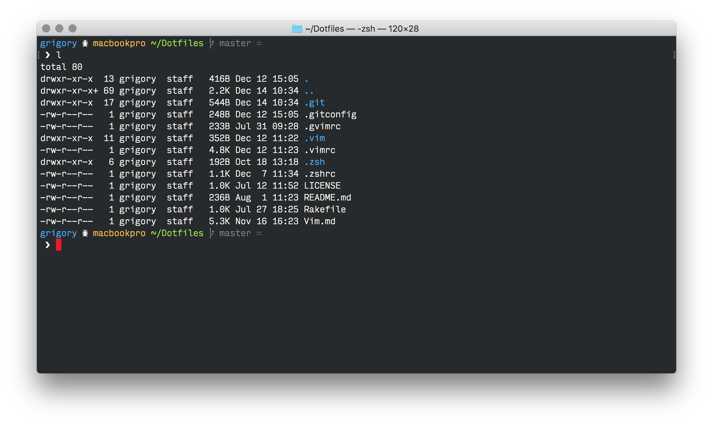
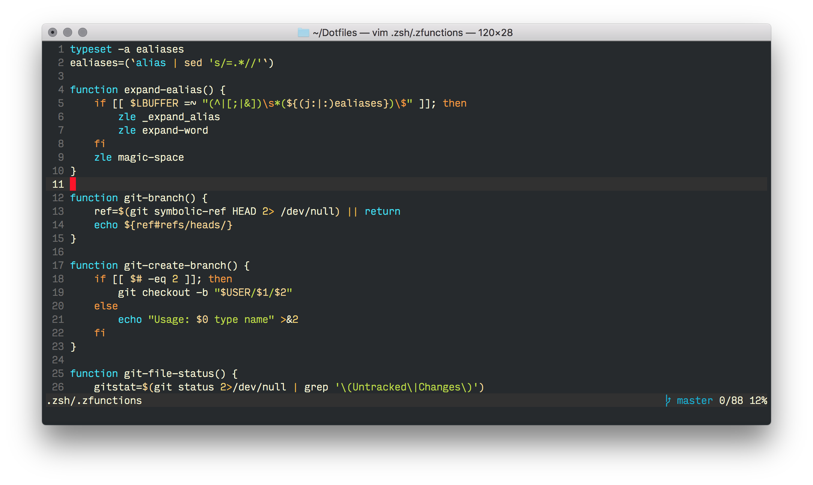
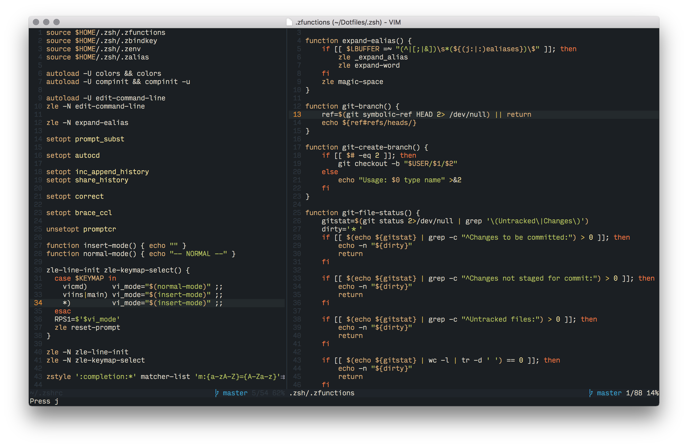

# Dotfiles

Keep dot files updated on different machines.
This repository contains main configuration for `zsh` and `vim` for great productivity.

## Installation

Run to update: `rake`

Main idea from this post:
[Synchronizing Dotfiles](http://benscheirman.com/2013/12/synchronizing-dotfiles/)

## Vim shortcuts

See [Vim.md](Vim.md) for details

## Screenshots

### Zsh in Terminal

How prompt and colors looks like.

OS X Terminal theme is [Argonaut](https://github.com/pwaleczek/Argonaut-theme)

### Vim in Terminal

Using Ayu2 theme:

### MacVim

Using Ayu2 theme:

## Font

I use nice [Input](http://input.fontbureau.com) font.
